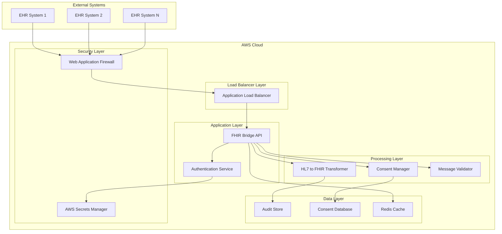

# Design Document

## Overview

The FHIR Bridge is a cloud-native Spring Boot application deployed on AWS that serves as a secure gateway for healthcare data interoperability. The system transforms HL7 v2 messages to FHIR R4 format while enforcing zero-trust security principles and TEFCA consent management. The architecture leverages AWS services for scalability, security, and compliance.

## Architecture

### High-Level Architecture



### Zero-Trust Security Model

The system implements zero-trust principles through:
- Mutual TLS (mTLS) for all communications
- JWT-based authentication with short-lived tokens
- Role-based access control (RBAC)
- Request-level authorization
- Comprehensive audit logging

## Components and Interfaces

### 1. API Gateway Layer

**FhirBridgeController**
- RESTful endpoints for HL7 v2 message submission
- FHIR R4 resource retrieval endpoints
- Health check and metrics endpoints
- OpenAPI 3.0 documentation

**Key Endpoints:**
```
POST /api/v1/transform/hl7v2-to-fhir
GET /api/v1/fhir/{resourceType}/{id}
GET /api/v1/consent/status/{patientId}
POST /api/v1/consent/update
```

### 2. Authentication and Authorization

**AuthenticationService**
- OAuth 2.0 / OpenID Connect integration
- JWT token validation and refresh
- Certificate-based authentication for system-to-system calls
- Integration with AWS Cognito for user management

**AuthorizationService**
- RBAC implementation with healthcare-specific roles
- Resource-level permissions
- TEFCA participant validation
- Scope-based access control

### 3. Message Processing Pipeline

**Hl7V2Validator**
- HL7 v2 message structure validation
- Segment and field validation
- Business rule validation
- Error reporting with detailed diagnostics

**Hl7ToFhirTransformer**
- Configurable mapping engine using HAPI FHIR
- Support for common HL7 v2 message types (ADT, ORM, ORU, etc.)
- Custom mapping rules for organization-specific requirements
- Transformation audit trail

**FhirValidator**
- FHIR R4 resource validation
- Profile validation (US Core, TEFCA profiles)
- Terminology validation
- Quality assurance checks

### 4. Consent Management

**ConsentManager**
- Patient consent verification
- Consent policy enforcement
- Data filtering based on consent preferences
- Integration with TEFCA consent frameworks

**ConsentRepository**
- Consent record storage and retrieval
- Consent history tracking
- Expiration management
- Audit trail for consent changes

### 5. Audit and Monitoring

**AuditService**
- Comprehensive logging of all data transformations
- Security event logging
- Performance metrics collection
- Compliance reporting

**MonitoringService**
- Health checks and system metrics
- Alert generation for system issues
- Performance monitoring
- Integration with AWS CloudWatch

## Data Models

### Core Domain Models

**Hl7Message**
```java
public class Hl7Message {
    private String messageId;
    private String messageType;
    private String sendingApplication;
    private String receivingApplication;
    private LocalDateTime timestamp;
    private String rawMessage;
    private MessageStatus status;
}
```

**FhirResource**
```java
public class FhirResource {
    private String resourceId;
    private String resourceType;
    private String fhirVersion;
    private String jsonContent;
    private String sourceMessageId;
    private LocalDateTime createdAt;
}
```

**ConsentRecord**
```java
public class ConsentRecord {
    private String patientId;
    private String organizationId;
    private ConsentStatus status;
    private List<DataCategory> allowedCategories;
    private LocalDateTime effectiveDate;
    private LocalDateTime expirationDate;
    private String policyReference;
}
```

**AuditEvent**
```java
public class AuditEvent {
    private String eventId;
    private String userId;
    private String action;
    private String resourceType;
    private String resourceId;
    private LocalDateTime timestamp;
    private String outcome;
    private Map<String, Object> details;
}
```

### Database Schema

The system uses PostgreSQL for persistent storage with the following key tables:
- `consent_records` - Patient consent information
- `audit_events` - Comprehensive audit trail
- `transformation_cache` - Cached transformation results
- `system_configuration` - System settings and mapping rules

## Error Handling

### Error Categories

1. **Validation Errors**
   - HL7 v2 format violations
   - FHIR R4 validation failures
   - Business rule violations

2. **Security Errors**
   - Authentication failures
   - Authorization violations
   - Certificate validation errors

3. **Consent Errors**
   - Missing consent records
   - Expired consent
   - Insufficient permissions

4. **System Errors**
   - Database connectivity issues
   - External service failures
   - Resource exhaustion

### Error Response Format

```json
{
  "error": {
    "code": "VALIDATION_ERROR",
    "message": "HL7 message validation failed",
    "details": [
      {
        "field": "PID.3",
        "issue": "Patient identifier is required"
      }
    ],
    "timestamp": "2025-01-15T10:30:00Z",
    "requestId": "req-12345"
  }
}
```

## Testing Strategy

### Unit Testing
- Service layer testing with mocked dependencies
- Transformation logic testing with sample HL7 messages
- Validation rule testing
- Security component testing

### Integration Testing
- End-to-end message transformation testing
- Database integration testing
- External service integration testing
- Authentication flow testing

### Security Testing
- Penetration testing for API endpoints
- Authentication and authorization testing
- TLS/SSL configuration validation
- Vulnerability scanning

### Performance Testing
- Load testing with realistic message volumes
- Stress testing for peak loads
- Latency testing for transformation operations
- Scalability testing with auto-scaling

### Compliance Testing
- TEFCA compliance validation
- HIPAA compliance verification
- Audit trail completeness testing
- Consent management testing

## Deployment Architecture

### AWS Infrastructure
- **Application Load Balancer** - Traffic distribution and SSL termination
- **ECS Fargate** - Containerized application hosting
- **RDS PostgreSQL** - Primary database with Multi-AZ deployment
- **ElastiCache Redis** - Caching layer for performance
- **AWS Secrets Manager** - Secure credential storage
- **CloudWatch** - Monitoring and logging
- **WAF** - Web application firewall protection

### Security Configuration
- VPC with private subnets for application and database tiers
- Security groups with least-privilege access
- IAM roles with minimal required permissions
- Encryption at rest and in transit
- Regular security patching and updates

### Scalability Features
- Auto-scaling based on CPU and memory utilization
- Database read replicas for improved performance
- CDN integration for static content
- Message queuing for high-volume processing